# JobScout

A full-stack job aggregation, scoring, and application tracking platform — built specifically around my Fall 2026 co-op search at Waterloo. Not a job board. A personal ops system that does the grunt work of finding, rating, and tracking applications so the only thing left is deciding where to apply.

---

## What it actually does

JobScout scrapes job listings on a schedule, runs each one through a weighted scoring rubric calibrated to my CV and target roles, and surfaces the ones worth looking at. Applied jobs flow into a separate dashboard with a full feedback pipeline — interview, rejected, ghosted, offer. Email alerts fire after every crawl with a digest of what's new and what scored high. A Chrome extension handles autofill on application forms using DOM field detection against a stored profile. The whole thing runs in production across a GCP VM, Vercel, Supabase, and GitHub Actions.

---

## Stack

**Frontend** — React + TypeScript (Vite), Tailwind CSS, Framer Motion, TanStack Table, Recharts, deployed on Vercel. Noir aesthetic throughout: `zinc-950` backgrounds, `amber-500` accents, Bebas Neue display font, JetBrains Mono for monospace.

**Backend** — FastAPI served by Gunicorn + Uvicorn workers behind Nginx on a GCP e2-micro VM. Celery + Celery Beat for scheduled tasks, backed by Upstash Redis. The VM started at 1GB RAM, hit the ceiling pretty fast, swapped 1GB from disk — runs fine at 1GB RAM + 1GB swap with no downtime.

**Database** — Supabase (Postgres). Production-configured with proper RLS. All job records, scores, breakdowns, application statuses, and feedback loop state live here.

**Scraping** — GitHub Actions cron on a 4-hour schedule hits the job sources and writes results to the DB. The scraping layer uses a combined approach: LinkedIn's internal API (undocumented but stable enough) for structured listings, plus a Playwright-based DOM scraper for boards that don't expose a clean API. The Playwright path handles resilient selector strategies across layout changes — it's kept behind a flag for now since LinkedIn started rate-limiting aggressively, but it works and is the fallback when API access degrades.

**Scoring** — pure Python weighted rubric, no LLM call at score time. Ten signals, each with its own weight. More on this below.

**LLM integration** — Groq (swapped from HuggingFace after credits ran out). Used for cover letter generation and, in the Chrome extension, for handling custom long-form questions on application forms. Not used in the scoring hot path — keeps latency and cost down.

**Email** — SMTP. Fires after every crawl run with a structured digest: new listings found, scores, any high-score alerts above threshold.

**Chrome extension** — vanilla JS, DOM field detection, calls backend for autofill data. Handles most standard fields well. Dropdowns and dynamic button-driven flows are the current weak spot.

**Secrets / config** — `.env` on the VM (never committed), environment variables defined in Vercel for frontend, a few small config files that export keys and stay gitignored. The VM runs ngrok with a static URL so the backend is reachable from Vercel and the extension without a static IP.

---

## Architecture

```

```

---

## Scoring

Every job gets scored before it hits the dashboard. The scoring function takes raw job data and returns a `final_score` (0–100) plus a `score_breakdown` with each signal's contribution.

Ten signals, each capped independently before weighting:

| Signal | What it measures | Weight |
|---|---|---|
| `title_score` | Keyword match against CS/internship/temporal terms | 1.5 |
| `employment_score` | Co-op/intern markers + fall 2026 temporal match | 2.0 |
| `company_score` | Company tier from Fortune 1K/2K/10K datasets | 0.5 |
| `skill_match_score` | Exact + adjacent CV skill overlap in JD | 1.8 |
| `role_relevance_score` | Strong/moderate role signals, QA/admin negatives | 1.7 |
| `red_flag_penalty` | Hard/soft penalties for experience reqs, unpaid, no visa | 2.5 |
| `salary_score` | Parsed hourly/annual → hourly, tiered score | 0.6 |
| `company_desc_score` | Domain match: SaaS, fintech, AI/ML, devtools etc. | 0.8 |
| `location_score` | Remote/hybrid boost, preferred city list | 0.3 |
| `culture_score` | Mentorship, equity, eng quality signals | 0.4 |

Deduplication is first-match-wins within each keyword group — longer/more specific keywords are checked before shorter fallbacks so "software engineer" doesn't also fire "engineer." Hard negatives (`red_flag_penalty` weight 2.5) are intentionally heavy — a single "3+ years experience required" tanks a listing regardless of how well everything else looks.

Two score thresholds gate the pipeline:
- `THRESHOLD_PRE_CL = 10.0` — minimum to even appear in the feed
- `THRESHOLD_POST_CL = 60.0` — triggers a cover letter generation prompt and email alert

The LLM semantic score is stubbed out in the codebase but not wired in yet — it's scoped as a tie-breaker once the rubric is stable.

---

## Dashboards

**Main dashboard** — job feed with animated score hero per card, score breakdown drawer, filter/sort via TanStack Table, a force-graph Job Orbit canvas that clusters jobs spatially by score and company, and an analytics drawer with charts on score distributions and source breakdown.

**Applied dashboard** — tracks everything after you've sent an application. Pipeline distribution chart, urgency heatmap, bulk actions via a Dock component, feedback loop dropdown (interview / rejected / ghosted / offer) per job, and confetti on status changes because why not.

---

## Chrome Extension (Apply AI)

Standalone extension, separate from the main frontend. Injects into job application pages, parses the DOM for form fields, and calls the backend `/autofill-profile` endpoint to populate what it can. Handles text inputs, basic selects, checkboxes well. Currently weak on: dropdown libraries (Material, Ant Design etc.), multi-step wizard flows, and long-form custom questions. The plan is to wire Groq into the extension for custom questions specifically — the right-click context menu path is already scoped.

---

## Infrastructure notes

The GCP VM is e2-micro — the smallest compute you can reasonably run a production backend on. Nginx handles SSL termination and proxies to Gunicorn which manages Uvicorn worker processes. Celery Beat runs as a systemd service alongside the API. The VM also has ngrok running as a service with a static domain, which is what lets Vercel and the extension hit the backend without a reserved static IP.

RAM was the main bottleneck — 1GB hit the wall fast once Celery + Uvicorn workers + Redis client were all live simultaneously. Swapping 1GB from disk fixed it cleanly, no performance issues in practice since disk swap almost never actually gets touched under normal load.

GitHub Actions handles the scraping entirely separately from the VM — that way the cron jobs don't eat into the VM's memory budget and can be monitored/rerun from the Actions dashboard independently.

---

## Reproducing this for your own use

The architecture is general enough to adapt for any job search. The main things you'd need to change:

1. **Scoring weights + keywords** — `scoring.py` is the whole rubric. Swap the CV skill lists, the temporal markers (fall 2026 etc.), the preferred location list, and the company CSVs for your own context.
2. **Supabase schema** — jobs table, applied_jobs table, score_breakdown JSONB column, feedback_status enum. The schema is straightforward, nothing exotic.
3. **Env setup** — Groq API key, Supabase URL + anon key, SMTP credentials, ngrok auth token + static domain. All in `.env` on the VM, mirrored in Vercel's environment variable panel for the frontend.
4. **VM** — any e2-micro or equivalent works. GCP free tier covers it. Set up Nginx + Gunicorn as systemd services, same for Celery Beat and ngrok.
5. **GitHub Actions** — the cron workflow triggers scraping on whatever schedule you want. The scraper writes directly to Supabase using the service role key.

There's intentionally no Docker setup here — the VM is simple enough that systemd service files are cleaner to manage than containers at this scale.

---

## What's next

The immediate next pillar is proper CV generation — not just cover letters. A structured template that gets populated from job data and the stored profile, with an LLM pass to tailor the content per role. The output should be something you'd actually send, not a rough draft.

Beyond that, the longer-term arc is full autonomy: the system doesn't just surface jobs and generate docs — it acts. That means an LLM agent + Playwright application bot that takes the generated cover letter and CV, navigates to the job application itself, fills the entire form (handling multi-step flows, dropdowns, custom questions), submits, and writes the status back to the dashboard. The Chrome extension autofill is a step toward this but it's still human-in-the-loop. The bot removes that.

And past that: a third dashboard that hooks into Gmail, parses incoming recruiter emails, associates them to applied positions, surfaces reply suggestions, and can generate and send follow-ups or prep schedules on request. Basically closing the loop on the entire job search lifecycle — find, apply, track, respond — without touching anything manually.


alr just help me brush up my read me please goat, thsi was my old but this was to just account for the tasks i had left like once i was 70% done with my jobscout project, if u want more info regarding the project, ill provide everything but for now just need documentation. It shouldn't sound AI-written, doesnt need to be too perfectly written basically, but it should be technical as fuck and clearly outline every tiny bit (so please ask for code as u need it, cause this was a lot of moving parts together)

Moreover, this isnt a product, just a personal project, so i am not trying to document for onboarding or downloading the repo and whatnot, just to present the project if ever people explore my page mate so i just need it to be clear about how it works, make any designs you can possibly in here PLEASE that help make it look proper and explain the flow better or if ever you need me to make smth let me know, and moreover, just cover the entire stack and all the moving parts, and perhaps a small hint at onboarding, but moreso, about how other can recreate this for their own use case (keep in mind we arent using the playwright approach anymore btw to fetch job information, but i dont mind you claiming it, since it was working and it only got blocked by linedkin, but it clearly works but for now i have kept it hidden regardless but u can outline this)

and briefly at the end put a briefing and also for future output, just say that whenever i find time, the next big pillar in the project, will be proper CV review with generation with a proper template, and moreover it'll have custom based of job information that it'll go for. And beyond that in an even more future iteration, it'll transform entirely into a fully automated flow with not only scraping jobs, rating them, making coverletters and cvs and sending me emails regarding their status and maintaining a clean dashboard, but itll also make sure to send emails/messages to employers regarding the position and more importantly, it'll allow fully automated application where it takes all the generated information and basically goes in to the job application itself, and auto fills the entire application (using an LLM agent + playwright methodology) and submits it and updates its status back in our dashboards for relevant jobs. And even beyond that, it'll be able to make a logs dashboard so a third dashboard that basically tracks my gmail feed for jobs and tries associating them to the corresponding applied position mate and also generates and can send further emails as needed or prep schedules basically. . . . . . .